# Introduction to GIT and GitHub!

## Contributing to GitHub projects

This is a GitHub project! How would you contribute to this?

### 1. Create a fork of the project

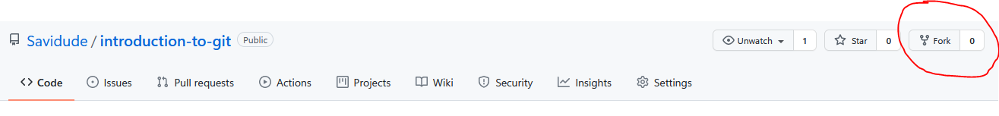

As it stands, you cannot write to the project because you are not the owner. When we click "Fork", we can create a copy of the current project in our own account.

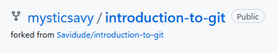

### 2. Clone (download) the forked project

The next step is to make changes to the copy of the project that we created. To do this, we need to download the project into our computer.

1. Copy the URL if the project.

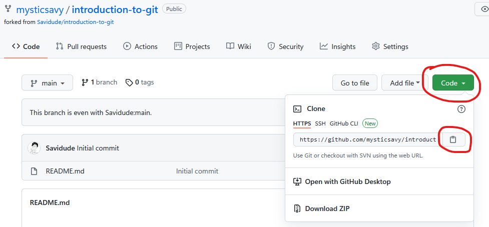

2. Open Git Bash and navigate to the location you want to clone the project to

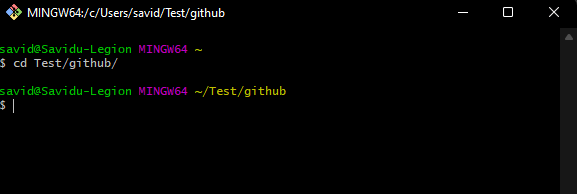

We can go to the folder we want by using the `cd` (change directory) command. I want to download the project into my `Test/github/` folder.
```bash
$ cd `Test/github/`
```

3. Clone the project

The project can be cloned into your project by simply running the `git clone` command. We must run `git clone <url_of_forked_project>` to clone the project.

```bash
$ git clone https://github.com/<your_username>/introduction-to-git.git
```

Note that we cannot paste into Git Bash using `ctrl + v` :( Instead, we must right click and select "paste" when pasting the URL.

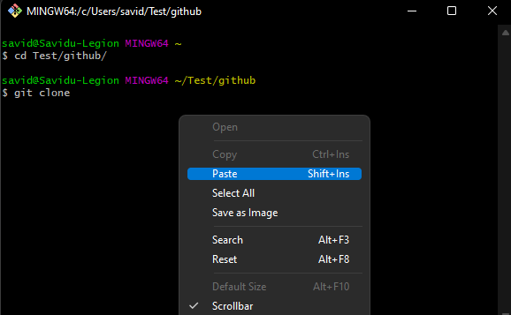
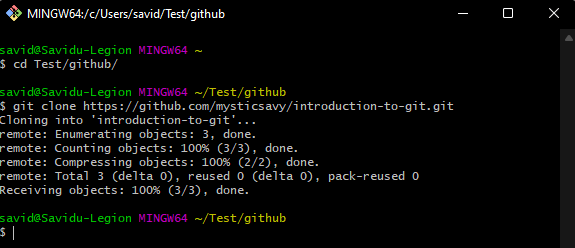

4. Navigate into the downloaded project

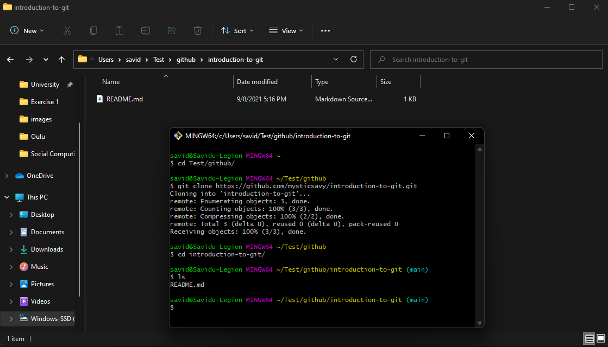

### 3. Make your own contribution

1. Create a folder with your name and write a Hello World program using the language of your choice within the folder.

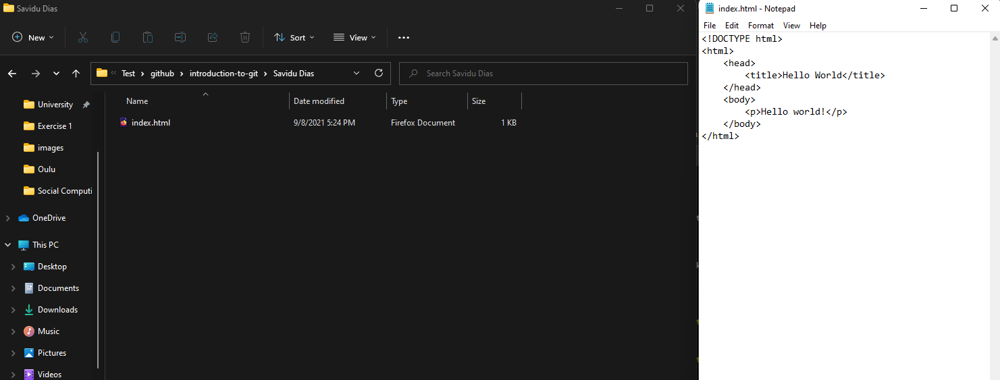

2. Add the file to git

We add files with the `git add` command. Think of adding files as preparing to upload them. We add the list of files we want to upload.

```bash
$ git add Savidu\ Dias/index.html
```

3. Commit the changes

In git, we can give a short message describing the changes we have made. We call this committing. This is done with the `git commit` command.

```bash
$ git commit -m "Hello World program by Savidu Dias"
```

When you run this command for the first time after downloading git, you may get an error like "Author identity unknown". This is because Git Bash does not know what your git account is.

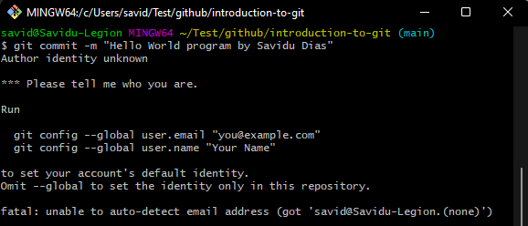

This can be resolved by giving your GitHub username and email address to Git Bash.
```bash
$ git config --global user.email "you@example.com"
$ git config --global user.name "Your Name"
```


Once the username and email is provided, we can run the `git commit` command one more time, and now, we can see that the files have been committed successfully.

4. Push (upload) your changes

You're almost there! The last thing you need to do is upload your changes. In git, we call this `pushing`. We push our changes with the `git push` command.

```bash
$ git push origin main
```

You will be asked to log into your GitHub account.

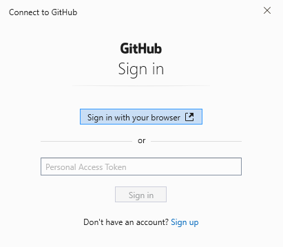
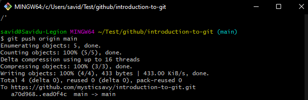

We can now see our changes in the forked repository!

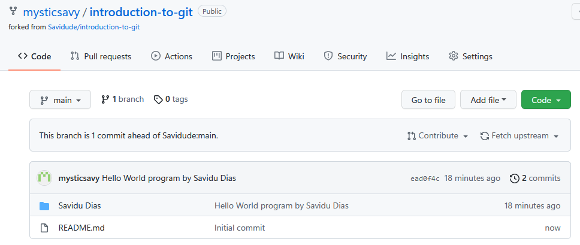

### 4. Create a Pull Request

If you go back to the [original project](https://github.com/Savidude/introduction-to-git), you would notice that the changes we pushed are not there yet. The changes are still in our forked repository.

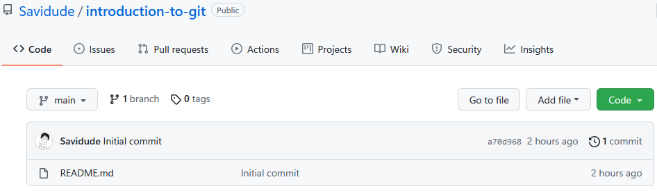

It might become a security risk if anyone can push anything they want at any time to a project. In order to get our changes into the original project, we need to send a request to the owners of the original project. This is called a `Pull Request`.

1. In your forked repository, select `Open pull request`.

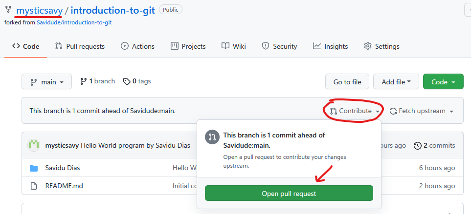

2. Review your changes and select `Create pull request`.

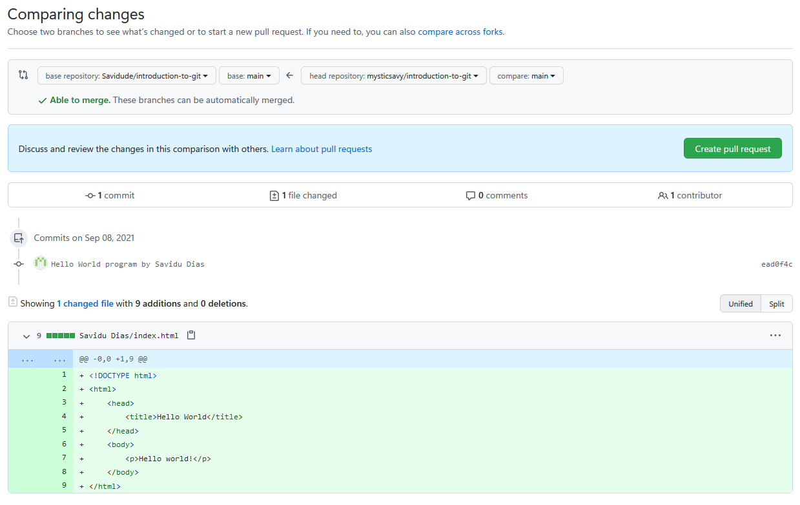

3. Provide a suitable title and description, and select `Create pull request`.


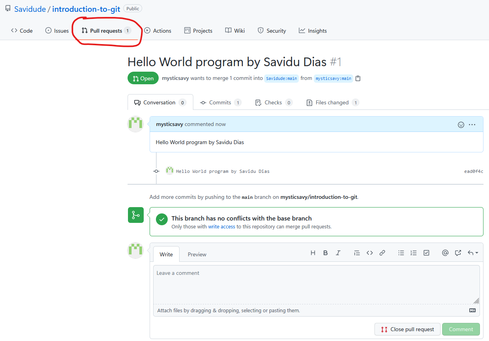

4. Wait for review and approval by the project owners.

Once the project owners approve your changes, they can merge them on to the original project. Now, we will be able to see your contributions.


